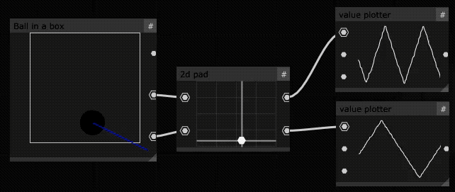

# ofxVpObjectsDaan
My personal objects collection for [Mosaic](https://github.com/d3cod3/Mosaic).

## Objects
- [x] lossyJpegCompression : Introduces JPEG artefacts on textures.
- [x] textureInformation : Helper for querying texture data. (Removed, now in ofxVisualPogramming!)  
- [x] ballInABox : Ball simulator with bang and position output.

## Screenshots

## ofxAddon dependencies
- ofxTurboJpeg addon by [Oriol Ferrer Mesia](https://github.com/armadillu/ofxTurboJpeg).

## Installation
- Put this repo into your OpenFrameworks addons directory.
- Install the required addons by following their readmes.

## Usage
- **Option 1 : Static addons hardcoded within Mosaic** (best if you compile Mosaic yourself or for debugging)  
  Add this addon to Mosaic/addons.mk.  
  _Depending on your Mosaic IDE you may need to regenerate the project or add the plugin files manually to the project._ 
  You're ready to compile Mosaic with these plugins !
- **Option 2 : Build the plugin and load it dynamically on runtime**  
  Compile `example-compile-binary-plugin` and add the produced binary to your Mosaic plugins folder. (**not yet implemented!**)

## Notes

### Xcode fixes:

- turboJPEG : if complaining about different target library compatibility: Set `Validate Workspace` to `yes`.
- Add to system header search paths : `/usr/local/include/opendht` (for opendht)
- After PG generation on Mosaic: follow ofxPd instructions & remove `ofxPd/libs/*` from project.
- Rm `ofxKinect/libs/libfreenect/src/*`

## Debugging
See which dlibs are loaded:
`DYLD_PRINT_LIBRARIES=1 DYLD_PRINT_LIBRARIES_POST_LAUNCH=1 DYLD_PRINT_RPATHS=1 ./MosaicDebug.app/Contents/MacOS/MosaicDebug`